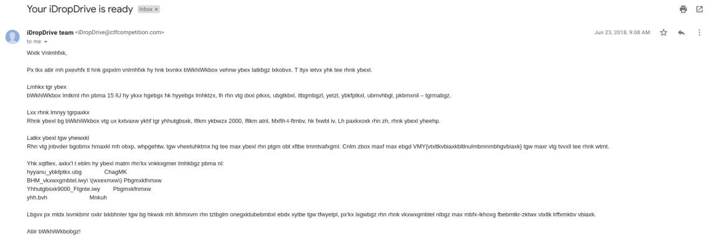

# OCR is cool (no, no it isn't)
We are given an archive with an image of an email:

-------------------------------------------

-------------------------------------------

I tried using an online optical character recognition (OCR) based on the hint
from the challenge name. After scanning through I saw VMM{...} which looked to
be the flag format but the letters are encrypted.

It looked like a ceasar cipher, so I used an online tool called [Cryptii](https://cryptii.com/pipes/caesar-cipher) to
decypher it. Unfortunately the flag was not accepted.

I found that the ocr was at fault and tried a few others but they all made mistakes.
After enought struggle I simply read the text from the image, put that through the ceasar cipher and there it is:

`CTF{caesarcipherisasubstitutioncipher}`

At the end the challenge name was quite ironic since ocr wasn't cool at all it just wasted my time.
